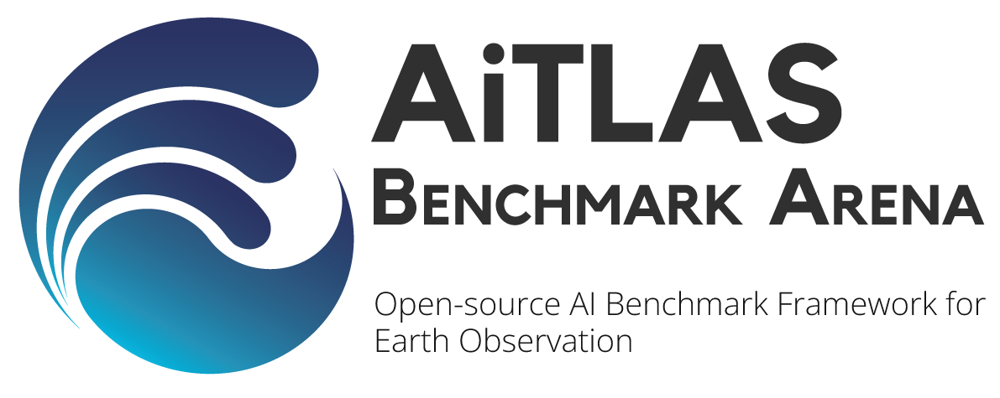

# AiTLAS: Benchmark Arena

We present **AiTLAS: Benchmark Arena** -- an open-source benchmark framework for evaluating state-of-the-art deep learning approaches for image classification in Earth Observation (EO). To this end, we present a comprehensive comparative analysis of more than 400 models derived from nine different state-of-the-art architectures, and compare them to a variety of multi-class and multi-label classification tasks from 22 datasets with different sizes and properties. In addition to models trained entirely on these datasets, we also benchmark models trained in the context of transfer learning, leveraging pre-trained model variants, as it is typically performed in practice. All presented approaches are general and can be easily extended to many other remote sensing image classification tasks. To ensure reproducibility and facilitate better usability and further developments, *all of the experimental resources* including the trained models, model configurations and processing details of the datasets (with their corresponding splits used for training and evaluating the models) are available on this repository. For furhter details, please refer to *[Current Trends in Deep Learning for Earth Observation: An Open-source Benchmark Arena for Image Classification](https://arxiv.org/abs/2207.07189)*.

*AiTLAS: Benchmark Arena* is part of the [**AiTLAS**](https://github.com/biasvariancelabs/aitlas) ecosystem, an open-source library for exploratory and predictive analysis of satellite imaginary pertaining to different remote-sensing tasks. 


# Citation
For attribution in academic contexts, please cite this **[work](https://arxiv.org/abs/2207.07189)** as
```
@article{aitlas_arena2022,
      title={{Current Trends in Deep Learning for Earth Observation:An Open-source Benchmark Arena for Image Classification}}, 
      author={Ivica Dimitrovski and Ivan Kitanovski and Dragi Kocev and Nikola Simidjievski},
      year={2022},
      journal={arXiv preprint arXiv:2207.07189},
}
```


# Datasets
### Multi-class datasets
|Dataset| Data source | Data Splits |||
|---|---|---|---|---|
|EuroSAT | [github](https://github.com/phelber/EuroSAT) | <a href="https://github.com/biasvariancelabs/LULC/blob/main/splits/eurosat_train.csv">train</a>|<a href="https://github.com/biasvariancelabs/LULC/blob/main/splits/eurosat_val.csv">validation</a>|<a href="https://github.com/biasvariancelabs/LULC/blob/main/splits/eurosat_test.csv">test</a>|
|UC Merced| [url](http://weegee.vision.ucmerced.edu/datasets/landuse.html) |<a href="https://github.com/biasvariancelabs/LULC/blob/main/splits/ucmerced_train.csv">train</a>|<a href="https://github.com/biasvariancelabs/LULC/blob/main/splits/ucmerced_val.csv">validation</a>|<a href="https://github.com/biasvariancelabs/LULC/blob/main/splits/ucmerced_test.csv">test</a>|
|RSSCN7| [figshare](https://figshare.com/articles/dataset/RSSCN7_Image_dataset/7006946) |<a href="https://github.com/biasvariancelabs/LULC/blob/main/splits/rsscn7_train.csv">train</a>|<a href="https://github.com/biasvariancelabs/LULC/blob/main/splits/rsscn7_val.csv">validation</a>|<a href="https://github.com/biasvariancelabs/LULC/blob/main/splits/rsscn7_test.csv">test</a>|
|WHU-RS19| [zip](http://captain.whu.edu.cn/datasets/WHU-RS19.zip) |<a href="https://github.com/biasvariancelabs/LULC/blob/main/splits/whurs19_train.csv">train</a>|<a href="https://github.com/biasvariancelabs/LULC/blob/main/splits/whurs19_val.csv">validation</a>|<a href="https://github.com/biasvariancelabs/LULC/blob/main/splits/whurs19_test.csv">test</a>|
|AID| [baidu](https://pan.baidu.com/s/1mifOBv6#list/path=%2F) |<a href="https://github.com/biasvariancelabs/LULC/blob/main/splits/aid_train.csv">train</a>|<a href="https://github.com/biasvariancelabs/LULC/blob/main/splits/aid_val.csv">validation</a>|<a href="https://github.com/biasvariancelabs/LULC/blob/main/splits/aid_test.csv">test</a>|
|SIRI-WHU| [figshare](https://figshare.com/articles/dataset/SIRI_WHU_Dataset/8796980) |<a href="https://github.com/biasvariancelabs/LULC/blob/main/splits/siriwhu_train.csv">train</a>|<a href="https://github.com/biasvariancelabs/LULC/blob/main/splits/siriwhu_val.csv">validation</a>|<a href="https://github.com/biasvariancelabs/LULC/blob/main/splits/siriwhu_test.csv">test</a>|
|RSI-CB256| [one drive](https://onedrive.live.com/?cid=010149152ff2b56d&id=10149152FF2B56D%21105&authkey=!ADyXDc-zA56zPv4) |<a href="https://github.com/biasvariancelabs/LULC/blob/main/splits/rsicb256_train.csv">train</a>|<a href="https://github.com/biasvariancelabs/LULC/blob/main/splits/rsicb256_val.csv">validation</a>|<a href="https://github.com/biasvariancelabs/LULC/blob/main/splits/rsicb256_test.csv">test</a>|
|RESISC45| [one drive](https://onedrive.live.com/?authkey=%21AHHNaHIlzp%5FIXjs&cid=5C5E061130630A68&id=5C5E061130630A68%21107&parId=5C5E061130630A68%21112&action=locate) |<a href="https://github.com/biasvariancelabs/LULC/blob/main/splits/resisc45_train.csv">train</a>|<a href="https://github.com/biasvariancelabs/LULC/blob/main/splits/resisc45_val.csv">validation</a>|<a href="https://github.com/biasvariancelabs/LULC/blob/main/splits/resisc45_test.csv">test</a>|
|PatternNet| [gdrive](https://drive.google.com/file/d/127lxXYqzO6Bd0yZhvEbgIfz95HaEnr9K/view) |<a href="https://github.com/biasvariancelabs/LULC/blob/main/splits/patternnet_train.csv">train</a>|<a href="https://github.com/biasvariancelabs/LULC/blob/main/splits/patternnet_val.csv">validation</a>|<a href="https://github.com/biasvariancelabs/LULC/blob/main/splits/patternnet_test.csv">test</a>|
|CLRS| [baidu](https://pan.baidu.com/share/init?surl=Xnw9k20Df_ICmkXdvasVqg) |<a href="https://github.com/biasvariancelabs/LULC/blob/main/splits/clrs_train.csv">train</a>|<a href="https://github.com/biasvariancelabs/LULC/blob/main/splits/clrs_val.csv">validation</a>|<a href="https://github.com/biasvariancelabs/LULC/blob/main/splits/clrs_test.csv">test</a>|
|RSD46-WHU| [baidu](https://pan.baidu.com/s/1mMDKUu02V0s8rXstewv26A) |<a href="https://github.com/biasvariancelabs/LULC/blob/main/splits/rsd46whu_train.csv">train</a>|<a href="https://github.com/biasvariancelabs/LULC/blob/main/splits/rsd46whu_val.csv">validation</a>|<a href="https://github.com/biasvariancelabs/LULC/blob/main/splits/rsd46whu_test.csv">test</a>|
|SAT6| [gdrive](https://drive.google.com/uc?id=0B0Fef71_vt3PUkZ4YVZ5WWNvZWs&export=download) |<a href="https://github.com/biasvariancelabs/LULC/blob/main/splits/sat6_train.csv">train</a>|<a href="https://github.com/biasvariancelabs/LULC/blob/main/splits/sat6_val.csv">validation</a>|<a href="https://github.com/biasvariancelabs/LULC/blob/main/splits/sat6_test.csv">test</a>|
|Optimal31| [gdrive](https://drive.google.com/file/d/1Fk9a0DW8UyyQsR8dP2Qdakmr69NVBhq9/view) |<a href="https://github.com/biasvariancelabs/LULC/blob/main/splits/optimal31_train.csv">train</a>|<a href="https://github.com/biasvariancelabs/LULC/blob/main/splits/optimal31_val.csv">validation</a>|<a href="https://github.com/biasvariancelabs/LULC/blob/main/splits/optimal31_test.csv">test</a>|
|Brazilian Coffee Scenes| [zip](http://www.patreo.dcc.ufmg.br/wp-content/uploads/2017/11/brazilian_coffee_dataset.zip) |<a href="https://github.com/biasvariancelabs/LULC/blob/main/splits/bcs_train.csv">train</a>|<a href="https://github.com/biasvariancelabs/LULC/blob/main/splits/bcs_val.csv">validation</a>|<a href="https://github.com/biasvariancelabs/LULC/blob/main/splits/bcs_test.csv">test</a>|
|So2Sat| [url](http://doi.org/10.14459/2018MP1454690) |<a href="https://dataserv.ub.tum.de/s/m1483140/download?path=%2F&files=training.h5">train</a>|<a href="https://dataserv.ub.tum.de/s/m1483140/download?path=%2F&files=validation.h5">validation</a>|<a href="https://dataserv.ub.tum.de/s/m1483140/download?path=%2F&files=testing.h5">test</a>|

###  Multi-label datasets

|Dataset| Data source | Data Splits |||
|---|---|---|---|---|
|UC Merced (mlc)|[gdrive](https://drive.google.com/file/d/1DtKiauowCB0ykjFe8v0OVvT76rEfOk0v/view)|<a href="https://github.com/biasvariancelabs/LULC/blob/main/splits/ucmercedmultilabel_train.csv">train</a>|<a href="https://github.com/biasvariancelabs/LULC/blob/main/splits/ucmercedmultilabel_val.csv">validation</a>|<a href="https://github.com/biasvariancelabs/LULC/blob/main/splits/ucmercedmultilabel_test.csv">test</a>|
|AID (mlc)|[github](https://github.com/Hua-YS/AID-Multilabel-Dataset)|<a href="https://github.com/biasvariancelabs/LULC/blob/main/splits/aidmultilabel_train.csv">train</a>|<a href="https://github.com/biasvariancelabs/LULC/blob/main/splits/aidmultilabel_val.csv">validation</a>|<a href="https://github.com/biasvariancelabs/LULC/blob/main/splits/aidmultilabel_test.csv">test</a>|
|DFC15|[gdrive](https://drive.google.com/drive/folders/1TKGS6TIRxQ6a7gdaj0cHs-mRCtv_J1HA)|<a href="https://github.com/biasvariancelabs/LULC/blob/main/splits/dfc15_train.csv">train</a>|<a href="https://github.com/biasvariancelabs/LULC/blob/main/splits/dfc15_val.csv">validation</a>|<a href="https://github.com/biasvariancelabs/LULC/blob/main/splits/dfc15_test.csv">test</a>|
|Planet UAS|[kaggle](https://www.kaggle.com/c/planet-understanding-the-amazon-from-space/overview)|<a href="https://github.com/biasvariancelabs/LULC/blob/main/splits/planetuas_train.csv">train</a>|<a href="https://github.com/biasvariancelabs/LULC/blob/main/splits/planetuas_val.csv">validation</a>|<a href="https://github.com/biasvariancelabs/LULC/blob/main/splits/planetuas_test.csv">test</a>|
|MLRSNet|[mendeley](https://data.mendeley.com/datasets/7j9bv9vwsx/2)|<a href="https://github.com/biasvariancelabs/LULC/blob/main/splits/mlrsnet_train.csv">train</a>|<a href="https://github.com/biasvariancelabs/LULC/blob/main/splits/mlrsnet_val.csv">validation</a>|<a href="https://github.com/biasvariancelabs/LULC/blob/main/splits/mlrsnet_test.csv">test</a>|
|BigEarthNet 19|[url](http://bigearth.net/)|<a href="https://github.com/biasvariancelabs/LULC/blob/main/splits/bigearthnet_train.csv">train</a>|<a href="https://github.com/biasvariancelabs/LULC/blob/main/splits/bigearthnet_val.csv">validation</a>|<a href="https://github.com/biasvariancelabs/LULC/blob/main/splits/bigearthnet_test.csv">test</a>|
|BigEarthNet 43|[url](http://bigearth.net/)|<a href="https://github.com/biasvariancelabs/LULC/blob/main/splits/bigearthnet_train.csv">train</a>|<a href="https://github.com/biasvariancelabs/LULC/blob/main/splits/bigearthnet_val.csv">validation</a>|<a href="https://github.com/biasvariancelabs/LULC/blob/main/splits/bigearthnet_test.csv">test</a>|

# Performance
## Pretrained [ImageNet-1K]

 ### Multi-class datasets

*Top-1 Accuracy (model rank wrt dataset)

| **Dataset\Model** | **DenseNet161 (2.6)** | **ViT (2.73)** | **ResNet152 (3.27)** | **ResNet50 (4.07)** | **MLP Mixer (4.67)** | **ConvNeXt (4.8)** | **EfficientNetB0 (5.13)** | **VGG16 (7.67)** | **AlexNet (8.93)** |
|-------------------|-----------------------|----------------|----------------------|---------------------|----------------------|--------------------|---------------------------|------------------|--------------------|
| **WHU-RS19**      | 100 (1)               | 99.502 (2)     | 98.01 (8)            | 99.502 (2)          | 98.507 (7)           | 99.005 (5)         | 99.502 (2)                | 99.005 (5)       | 93.532 (9)         |
| **Optimal31**     | 94.355 (2)            | 94.624 (1)     | 92.473 (5)           | 92.204 (6)          | 92.742 (4)           | 93.011 (3)         | 91.667 (7)                | 88.71 (8)        | 80.914 (9)         |
| **UC merced**     | 98.333 (4)            | 98.333 (4)     | 98.81 (1)            | 98.571 (2)          | 98.333 (4)           | 97.857 (7)         | 98.571 (2)                | 95.476 (8)       | 92.143 (9)         |
| **SIRI-WHU**      | 95.625 (3)            | 95.625 (3)     | 96.25 (1)            | 95 (6)              | 95.208 (5)           | 96.25 (1)          | 95 (6)                    | 93.958 (8)       | 92.292 (9)         |
| **RSSCN7**        | 94.821 (6)            | 95.893 (1)     | 95 (4)               | 95 (4)              | 95.179 (3)           | 94.643 (7)         | 95.536 (2)                | 93.929 (8)       | 91.964 (9)         |
| **BCS**           | 92.708 (2)            | 92.014 (4)     | 92.361 (3)           | 92.014 (4)          | 93.056 (1)           | 91.493 (6)         | 91.319 (7)                | 90.972 (8)       | 89.583 (9)         |
| **AID**           | 97.25 (2)             | 97.75 (1)      | 97.2 (3)             | 96.55 (6)           | 96.7 (5)             | 96.95 (4)          | 96.25 (7)                 | 96.1 (8)         | 92.9 (9)           |
| **CLRS**          | 92.2 (2)              | 93.2 (1)       | 91.9 (3)             | 91.567 (4)          | 90.1 (7)             | 91.1 (5)           | 90.5 (6)                  | 89.9 (8)         | 84.1 (9)           |
| **RSI-CB256**     | 99.737 (3)            | 99.758 (2)     | 99.859 (1)           | 99.677 (5)          | 99.657 (6)           | 99.596 (7)         | 99.717 (4)                | 99.051 (9)       | 99.354 (8)         |
| **Eurosat**       | 98.889 (3)            | 98.722 (7)     | 99 (1)               | 98.833 (4)          | 98.741 (6)           | 98.778 (5)         | 98.907 (2)                | 98.148 (8)       | 97.574 (9)         |
| **PatternNet**    | 99.737 (1)            | 99.655 (5)     | 99.49 (7)            | 99.737 (1)          | 99.704 (3)           | 99.671 (4)         | 99.539 (6)                | 99.424 (8)       | 99.161 (9)         |
| **RESISC45**      | 96.508 (3)            | 97.079 (1)     | 96.54 (2)            | 96.46 (4)           | 95.952 (6)           | 96.27 (5)          | 94.873 (7)                | 93.905 (8)       | 90.492 (9)         |
| **RSD46-WHU**     | 94.507 (1)            | 94.238 (3)     | 94.404 (2)           | 94.158 (4)          | 93.673 (5)           | 93.627 (6)         | 93.387 (7)                | 92.422 (8)       | 90.646 (9)         |
| **So2Sat**        | 65.756 (5)            | 68.551 (1)     | 65.169 (7)           | 61.903 (8)          | 67.066 (2)           | 66.169 (3)         | 65.801 (4)                | 65.375 (6)       | 59.203 (9)         |
| **SAT6**          | 100 (1)               | 99.998 (5)     | 100 (1)              | 100 (1)             | 99.995 (6)           | 99.999 (4)         | 99.988 (8)                | 99.993 (7)       | 99.98 (9)          |

### Multi-label datasets

*Mean Average Precision mAP (model rank wrt dataset)
| **Dataset\Model**  | **ConvNeXt (3.14)** | **ViT (3.71)** | **DenseNet161 (3.86)** | **ResNet50 (4)** | **ResNet152 (4.29)** | **MLP Mixer (4.57)** | **EfficientNetB0 (5.71)** | **VGG16 (6.71)** | **AlexNet (8.86)** |
|--------------------|---------------------|----------------|------------------------|------------------|----------------------|----------------------|---------------------------|------------------|--------------------|
| **AID (mlc)**            | 82.298 (1)          | 81.539 (3)     | 81.708 (2)             | 80.758 (6)       | 80.942 (4)           | 80.879 (5)           | 78.002 (8)                | 79.893 (7)       | 75.906 (9)         |
| **UC Merced (mlc)**      | 96.431 (2)          | 96.699 (1)     | 96.056 (4)             | 95.665 (6)       | 96.01 (5)            | 96.34 (3)            | 95.384 (7)                | 92.848 (8)       | 92.638 (9)         |
| **DFC15**          | 97.994 (1)          | 97.617 (4)     | 97.529 (6)             | 97.662 (3)       | 97.6 (5)             | 97.941 (2)           | 96.787 (7)                | 96.566 (8)       | 94.057 (9)         |
| **Planet UAS**     | 66.447 (5)          | 66.804 (2)     | 66.339 (3)             | 65.528 (4)       | 64.825 (1)           | 67.33 (7)            | 64.157 (6)                | 65.584 (8)       | 64.048 (9)         |
| **MLRSNet**        | 95.807 (3)          | 96.41 (2)      | 96.306 (4)             | 96.272 (6)       | 96.432 (7)           | 95.049 (1)           | 95.391 (8)                | 94.633 (5)       | 93.399 (9)         |
| **BigEarthNet 43** | 66.166 (2)          | 58.997 (8)     | 64.229 (4)             | 66.256 (1)       | 64.066 (5)           | 59.648 (7)           | 64.589 (3)                | 61.205 (6)       | 58.554 (9)         |
| **BigEarthNet 19** | 77.147 (8)          | 77.31 (6)      | 79.686 (4)             | 79.983 (2)       | 79.776 (3)           | 77.288 (7)           | 80.221 (1)                | 78.418 (5)       | 77.147 (8)         |

# Models

All trained models are available **[here](https://drive.google.com/drive/folders/1lTnPsMyyLv9XoPu3cMmE_h6NPkj_WCH8?usp=sharing)**

## Model list 

<table>
<tr><th> Multi-class classification tasks</th><th> Multi-label classification tasks</th></tr>
<tr><td>


| Dataset        | Model          | from scratch         | pretrained [ImageNet1K] |
|----------------|----------------|----------------------|-------------------------|
| AID            | AlexNet        | :heavy\_check\_mark: | :heavy\_check\_mark:    |
|                | VGG16          | :heavy\_check\_mark: | :heavy\_check\_mark:    |
|                | ResNet50       | :heavy\_check\_mark: | :heavy\_check\_mark:    |
|                | ResNet152      | :heavy\_check\_mark: | :heavy\_check\_mark:    |
|                | DenseNet161    | :heavy\_check\_mark: | :heavy\_check\_mark:    |
|                | EfficientNetB0 | :heavy\_check\_mark: | :heavy\_check\_mark:    |
|                | ViT            | :heavy\_check\_mark: | :heavy\_check\_mark:    |
|                | MLPMixer       | :heavy\_check\_mark: | :heavy\_check\_mark:    |
|                | ConvNeXt       | :heavy\_check\_mark: | :heavy\_check\_mark:    |
| BCS            | AlexNet        | :heavy\_check\_mark: | :heavy\_check\_mark:    |
|                | VGG16          | :heavy\_check\_mark: | :heavy\_check\_mark:    |
|                | ResNet50       | :heavy\_check\_mark: | :heavy\_check\_mark:    |
|                | ResNet152      | :heavy\_check\_mark: | :heavy\_check\_mark:    |
|                | DenseNet161    | :heavy\_check\_mark: | :heavy\_check\_mark:    |
|                | EfficientNetB0 | :heavy\_check\_mark: | :heavy\_check\_mark:    |
|                | ViT            | :heavy\_check\_mark: | :heavy\_check\_mark:    |
|                | MLPMixer       | :heavy\_check\_mark: | :heavy\_check\_mark:    |
|                | ConvNeXt       | :heavy\_check\_mark: | :heavy\_check\_mark:    |
| CLRS           | AlexNet        | :heavy\_check\_mark: | :heavy\_check\_mark:    |
|                | VGG16          | :heavy\_check\_mark: | :heavy\_check\_mark:    |
|                | ResNet50       | :heavy\_check\_mark: | :heavy\_check\_mark:    |
|                | ResNet152      | :heavy\_check\_mark: | :heavy\_check\_mark:    |
|                | DenseNet161    | :heavy\_check\_mark: | :heavy\_check\_mark:    |
|                | EfficientNetB0 | :heavy\_check\_mark: | :heavy\_check\_mark:    |
|                | ViT            | :heavy\_check\_mark: | :heavy\_check\_mark:    |
|                | MLPMixer       | :heavy\_check\_mark: | :heavy\_check\_mark:    |
|                | ConvNeXt       | :heavy\_check\_mark: | :heavy\_check\_mark:    |
| Eurosat        | AlexNet        | :heavy\_check\_mark: | :heavy\_check\_mark:    |
|                | VGG16          | :heavy\_check\_mark: | :heavy\_check\_mark:    |
|                | ResNet50       | :heavy\_check\_mark: | :heavy\_check\_mark:    |
|                | ResNet152      | :heavy\_check\_mark: | :heavy\_check\_mark:    |
|                | DenseNet161    | :heavy\_check\_mark: | :heavy\_check\_mark:    |
|                | EfficientNetB0 | :heavy\_check\_mark: | :heavy\_check\_mark:    |
|                | ViT            | :heavy\_check\_mark: | :heavy\_check\_mark:    |
|                | MLPMixer       | :heavy\_check\_mark: | :heavy\_check\_mark:    |
|                | ConvNeXt       | :heavy\_check\_mark: | :heavy\_check\_mark:    |
| Optimal31      | AlexNet        | :heavy\_check\_mark: | :heavy\_check\_mark:    |
|                | VGG16          | :heavy\_check\_mark: | :heavy\_check\_mark:    |
|                | ResNet50       | :heavy\_check\_mark: | :heavy\_check\_mark:    |
|                | ResNet152      | :heavy\_check\_mark: | :heavy\_check\_mark:    |
|                | DenseNet161    | :heavy\_check\_mark: | :heavy\_check\_mark:    |
|                | EfficientNetB0 | :heavy\_check\_mark: | :heavy\_check\_mark:    |
|                | ViT            | :heavy\_check\_mark: | :heavy\_check\_mark:    |
|                | MLPMixer       | :heavy\_check\_mark: | :heavy\_check\_mark:    |
|                | ConvNeXt       | :heavy\_check\_mark: | :heavy\_check\_mark:    |
| PatternNet     | AlexNet        | :heavy\_check\_mark: | :heavy\_check\_mark:    |
|                | VGG16          | :heavy\_check\_mark: | :heavy\_check\_mark:    |
|                | ResNet50       | :heavy\_check\_mark: | :heavy\_check\_mark:    |
|                | ResNet152      | :heavy\_check\_mark: | :heavy\_check\_mark:    |
|                | DenseNet161    | :heavy\_check\_mark: | :heavy\_check\_mark:    |
|                | EfficientNetB0 | :heavy\_check\_mark: | :heavy\_check\_mark:    |
|                | ViT            | :heavy\_check\_mark: | :heavy\_check\_mark:    |
|                | MLPMixer       | :heavy\_check\_mark: | :heavy\_check\_mark:    |
|                | ConvNeXt       | :heavy\_check\_mark: | :heavy\_check\_mark:    |
| RESISC45       | AlexNet        | :heavy\_check\_mark: | :heavy\_check\_mark:    |
|                | VGG16          | :heavy\_check\_mark: | :heavy\_check\_mark:    |
|                | ResNet50       | :heavy\_check\_mark: | :heavy\_check\_mark:    |
|                | ResNet152      | :heavy\_check\_mark: | :heavy\_check\_mark:    |
|                | DenseNet161    | :heavy\_check\_mark: | :heavy\_check\_mark:    |
|                | EfficientNetB0 | :heavy\_check\_mark: | :heavy\_check\_mark:    |
|                | ViT            | :heavy\_check\_mark: | :heavy\_check\_mark:    |
|                | MLPMixer       | :heavy\_check\_mark: | :heavy\_check\_mark:    |
|                | ConvNeXt       | :heavy\_check\_mark: | :heavy\_check\_mark:    |
| RSD46-WHU      | AlexNet        | :heavy\_check\_mark: | :heavy\_check\_mark:    |
|                | VGG16          | :heavy\_check\_mark: | :heavy\_check\_mark:    |
|                | ResNet50       | :heavy\_check\_mark: | :heavy\_check\_mark:    |
|                | ResNet152      | :heavy\_check\_mark: | :heavy\_check\_mark:    |
|                | DenseNet161    | :heavy\_check\_mark: | :heavy\_check\_mark:    |
|                | EfficientNetB0 | :heavy\_check\_mark: | :heavy\_check\_mark:    |
|                | ViT            | :heavy\_check\_mark: | :heavy\_check\_mark:    |
|                | MLPMixer       | :heavy\_check\_mark: | :heavy\_check\_mark:    |
|                | ConvNeXt       | :heavy\_check\_mark: | :heavy\_check\_mark:    |


</td><td>

| Dataset        | Model          | from scratch         | pretrained [ImageNet1K] |
|----------------|----------------|----------------------|-------------------------|
| RSI-CB256      | AlexNet        | :heavy\_check\_mark: | :heavy\_check\_mark:    |
|                | VGG16          | :heavy\_check\_mark: | :heavy\_check\_mark:    |
|                | ResNet50       | :heavy\_check\_mark: | :heavy\_check\_mark:    |
|                | ResNet152      | :heavy\_check\_mark: | :heavy\_check\_mark:    |
|                | DenseNet161    | :heavy\_check\_mark: | :heavy\_check\_mark:    |
|                | EfficientNetB0 | :heavy\_check\_mark: | :heavy\_check\_mark:    |
|                | ViT            | :heavy\_check\_mark: | :heavy\_check\_mark:    |
|                | MLPMixer       | :heavy\_check\_mark: | :heavy\_check\_mark:    |
|                | ConvNeXt       | :heavy\_check\_mark: | :heavy\_check\_mark:    |
| RSSCN7         | AlexNet        | :heavy\_check\_mark: | :heavy\_check\_mark:    |
|                | VGG16          | :heavy\_check\_mark: | :heavy\_check\_mark:    |
|                | ResNet50       | :heavy\_check\_mark: | :heavy\_check\_mark:    |
|                | ResNet152      | :heavy\_check\_mark: | :heavy\_check\_mark:    |
|                | DenseNet161    | :heavy\_check\_mark: | :heavy\_check\_mark:    |
|                | EfficientNetB0 | :heavy\_check\_mark: | :heavy\_check\_mark:    |
|                | ViT            | :heavy\_check\_mark: | :heavy\_check\_mark:    |
|                | MLPMixer       | :heavy\_check\_mark: | :heavy\_check\_mark:    |
|                | ConvNeXt       | :heavy\_check\_mark: | :heavy\_check\_mark:    |
| SAT6           | AlexNet        | :heavy\_check\_mark: | :heavy\_check\_mark:    |
|                | VGG16          | :heavy\_check\_mark: | :heavy\_check\_mark:    |
|                | ResNet50       | :heavy\_check\_mark: | :heavy\_check\_mark:    |
|                | ResNet152      | :heavy\_check\_mark: | :heavy\_check\_mark:    |
|                | DenseNet161    | :heavy\_check\_mark: | :heavy\_check\_mark:    |
|                | EfficientNetB0 | :heavy\_check\_mark: | :heavy\_check\_mark:    |
|                | ViT            | :heavy\_check\_mark: | :heavy\_check\_mark:    |
|                | MLPMixer       | :heavy\_check\_mark: | :heavy\_check\_mark:    |
|                | ConvNeXt       | :heavy\_check\_mark: | :heavy\_check\_mark:    |
| SIRI-WHU       | AlexNet        | :heavy\_check\_mark: | :heavy\_check\_mark:    |
|                | VGG16          | :heavy\_check\_mark: | :heavy\_check\_mark:    |
|                | ResNet50       | :heavy\_check\_mark: | :heavy\_check\_mark:    |
|                | ResNet152      | :heavy\_check\_mark: | :heavy\_check\_mark:    |
|                | DenseNet161    | :heavy\_check\_mark: | :heavy\_check\_mark:    |
|                | EfficientNetB0 | :heavy\_check\_mark: | :heavy\_check\_mark:    |
|                | ViT            | :heavy\_check\_mark: | :heavy\_check\_mark:    |
|                | MLPMixer       | :heavy\_check\_mark: | :heavy\_check\_mark:    |
|                | ConvNeXt       | :heavy\_check\_mark: | :heavy\_check\_mark:    |
| So2Sat         | AlexNet        | :heavy\_check\_mark: | :heavy\_check\_mark:    |
|                | VGG16          | :heavy\_check\_mark: | :heavy\_check\_mark:    |
|                | ResNet50       | :heavy\_check\_mark: | :heavy\_check\_mark:    |
|                | ResNet152      | :heavy\_check\_mark: | :heavy\_check\_mark:    |
|                | DenseNet161    | :heavy\_check\_mark: | :heavy\_check\_mark:    |
|                | EfficientNetB0 | :heavy\_check\_mark: | :heavy\_check\_mark:    |
|                | ViT            | :heavy\_check\_mark: | :heavy\_check\_mark:    |
|                | MLPMixer       | :heavy\_check\_mark: | :heavy\_check\_mark:    |
|                | ConvNeXt       | :heavy\_check\_mark: | :heavy\_check\_mark:    |
| UCMerced       | AlexNet        | :heavy\_check\_mark: | :heavy\_check\_mark:    |
|                | VGG16          | :heavy\_check\_mark: | :heavy\_check\_mark:    |
|                | ResNet50       | :heavy\_check\_mark: | :heavy\_check\_mark:    |
|                | ResNet152      | :heavy\_check\_mark: | :heavy\_check\_mark:    |
|                | DenseNet161    | :heavy\_check\_mark: | :heavy\_check\_mark:    |
|                | EfficientNetB0 | :heavy\_check\_mark: | :heavy\_check\_mark:    |
|                | ViT            | :heavy\_check\_mark: | :heavy\_check\_mark:    |
|                | MLPMixer       | :heavy\_check\_mark: | :heavy\_check\_mark:    |
|                | ConvNeXt       | :heavy\_check\_mark: | :heavy\_check\_mark:    |
| WHU-RS19       | AlexNet        | :heavy\_check\_mark: | :heavy\_check\_mark:    |
|                | VGG16          | :heavy\_check\_mark: | :heavy\_check\_mark:    |
|                | ResNet50       | :heavy\_check\_mark: | :heavy\_check\_mark:    |
|                | ResNet152      | :heavy\_check\_mark: | :heavy\_check\_mark:    |
|                | DenseNet161    | :heavy\_check\_mark: | :heavy\_check\_mark:    |
|                | EfficientNetB0 | :heavy\_check\_mark: | :heavy\_check\_mark:    |
|                | ViT            | :heavy\_check\_mark: | :heavy\_check\_mark:    |
|                | MLPMixer       | :heavy\_check\_mark: | :heavy\_check\_mark:    |
|                | ConvNeXt       | :heavy\_check\_mark: | :heavy\_check\_mark:    |


</td></tr> </table>


### Multi-label classification tasks

| Dataset        | Model          | from scratch         | pretrained [ImageNet1K] |
|----------------|----------------|----------------------|-------------------------|
| AID (mlc)      | AlexNet        | :heavy\_check\_mark: | :heavy\_check\_mark:    |
|                | VGG16          | :heavy\_check\_mark: | :heavy\_check\_mark:    |
|                | ResNet50       | :heavy\_check\_mark: | :heavy\_check\_mark:    |
|                | ResNet152      | :heavy\_check\_mark: | :heavy\_check\_mark:    |
|                | DenseNet161    | :heavy\_check\_mark: | :heavy\_check\_mark:    |
|                | EfficientNetB0 | :heavy\_check\_mark: | :heavy\_check\_mark:    |
|                | ViT            | :heavy\_check\_mark: | :heavy\_check\_mark:    |
|                | MLPMixer       | :heavy\_check\_mark: | :heavy\_check\_mark:    |
|                | ConvNeXt       | :heavy\_check\_mark: | :heavy\_check\_mark:    |
| BigEarthNet19  | AlexNet        | :heavy\_check\_mark: | :heavy\_check\_mark:    |
|                | VGG16          | :heavy\_check\_mark: | :heavy\_check\_mark:    |
|                | ResNet50       | :heavy\_check\_mark: | :heavy\_check\_mark:    |
|                | ResNet152      | :heavy\_check\_mark: | :heavy\_check\_mark:    |
|                | DenseNet161    | :heavy\_check\_mark: | :heavy\_check\_mark:    |
|                | EfficientNetB0 | :heavy\_check\_mark: | :heavy\_check\_mark:    |
|                | ViT            | :heavy\_check\_mark: | :heavy\_check\_mark:    |
|                | MLPMixer       | :heavy\_check\_mark: | :heavy\_check\_mark:    |
|                | ConvNeXt       | :heavy\_check\_mark: | :heavy\_check\_mark:    |
| BigEarthNet43  | AlexNet        | :heavy\_check\_mark: | :heavy\_check\_mark:    |
|                | VGG16          | :heavy\_check\_mark: | :heavy\_check\_mark:    |
|                | ResNet50       | :heavy\_check\_mark: | :heavy\_check\_mark:    |
|                | ResNet152      | :heavy\_check\_mark: | :heavy\_check\_mark:    |
|                | DenseNet161    | :heavy\_check\_mark: | :heavy\_check\_mark:    |
|                | EfficientNetB0 | :heavy\_check\_mark: | :heavy\_check\_mark:    |
|                | ViT            | :heavy\_check\_mark: | :heavy\_check\_mark:    |
|                | MLPMixer       | :heavy\_check\_mark: | :heavy\_check\_mark:    |
|                | ConvNeXt       | :heavy\_check\_mark: | :heavy\_check\_mark:    |
| DFC15          | AlexNet        | :heavy\_check\_mark: | :heavy\_check\_mark:    |
|                | VGG16          | :heavy\_check\_mark: | :heavy\_check\_mark:    |
|                | ResNet50       | :heavy\_check\_mark: | :heavy\_check\_mark:    |
|                | ResNet152      | :heavy\_check\_mark: | :heavy\_check\_mark:    |
|                | DenseNet161    | :heavy\_check\_mark: | :heavy\_check\_mark:    |
|                | EfficientNetB0 | :heavy\_check\_mark: | :heavy\_check\_mark:    |
|                | ViT            | :heavy\_check\_mark: | :heavy\_check\_mark:    |
|                | MLPMixer       | :heavy\_check\_mark: | :heavy\_check\_mark:    |
|                | ConvNeXt       | :heavy\_check\_mark: | :heavy\_check\_mark:    |
| MLRSNet        | AlexNet        | :heavy\_check\_mark: | :heavy\_check\_mark:    |
|                | VGG16          | :heavy\_check\_mark: | :heavy\_check\_mark:    |
|                | ResNet50       | :heavy\_check\_mark: | :heavy\_check\_mark:    |
|                | ResNet152      | :heavy\_check\_mark: | :heavy\_check\_mark:    |
|                | DenseNet161    | :heavy\_check\_mark: | :heavy\_check\_mark:    |
|                | EfficientNetB0 | :heavy\_check\_mark: | :heavy\_check\_mark:    |
|                | ViT            | :heavy\_check\_mark: | :heavy\_check\_mark:    |
|                | MLPMixer       | :heavy\_check\_mark: | :heavy\_check\_mark:    |
|                | ConvNeXt       | :heavy\_check\_mark: | :heavy\_check\_mark:    |
| PlanetUAS      | AlexNet        | :heavy\_check\_mark: | :heavy\_check\_mark:    |
|                | VGG16          | :heavy\_check\_mark: | :heavy\_check\_mark:    |
|                | ResNet50       | :heavy\_check\_mark: | :heavy\_check\_mark:    |
|                | ResNet152      | :heavy\_check\_mark: | :heavy\_check\_mark:    |
|                | DenseNet161    | :heavy\_check\_mark: | :heavy\_check\_mark:    |
|                | EfficientNetB0 | :heavy\_check\_mark: | :heavy\_check\_mark:    |
|                | ViT            | :heavy\_check\_mark: | :heavy\_check\_mark:    |
|                | MLPMixer       | :heavy\_check\_mark: | :heavy\_check\_mark:    |
|                | ConvNeXt       | :heavy\_check\_mark: | :heavy\_check\_mark:    |
| UCMerced (mlc) | AlexNet        | :heavy\_check\_mark: | :heavy\_check\_mark:    |
|                | VGG16          | :heavy\_check\_mark: | :heavy\_check\_mark:    |
|                | ResNet50       | :heavy\_check\_mark: | :heavy\_check\_mark:    |
|                | ResNet152      | :heavy\_check\_mark: | :heavy\_check\_mark:    |
|                | DenseNet161    | :heavy\_check\_mark: | :heavy\_check\_mark:    |
|                | EfficientNetB0 | :heavy\_check\_mark: | :heavy\_check\_mark:    |
|                | ViT            | :heavy\_check\_mark: | :heavy\_check\_mark:    |
|                | MLPMixer       | :heavy\_check\_mark: | :heavy\_check\_mark:    |
|                | ConvNeXt       | :heavy\_check\_mark: | :heavy\_check\_mark:    |
